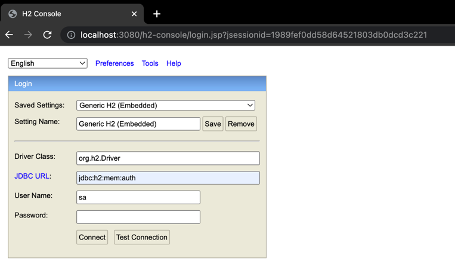
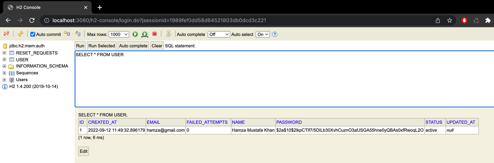
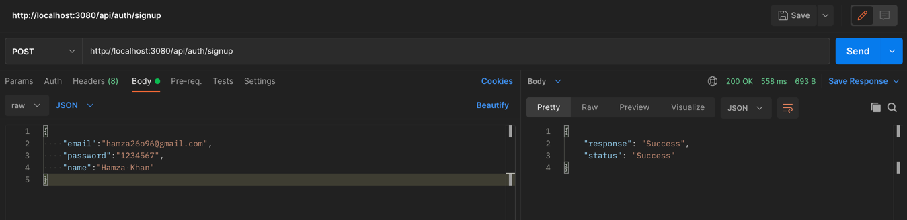
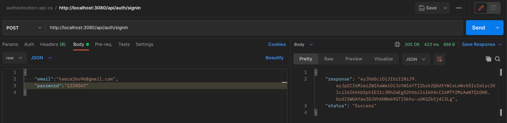
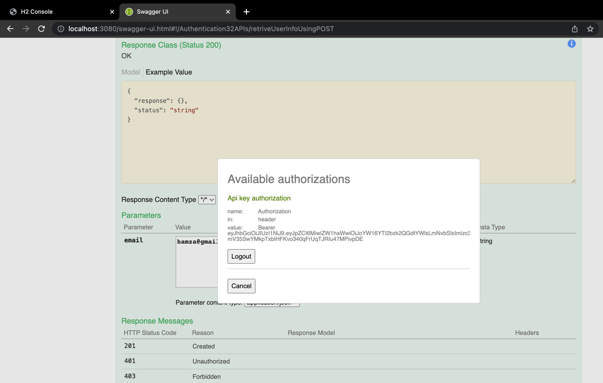
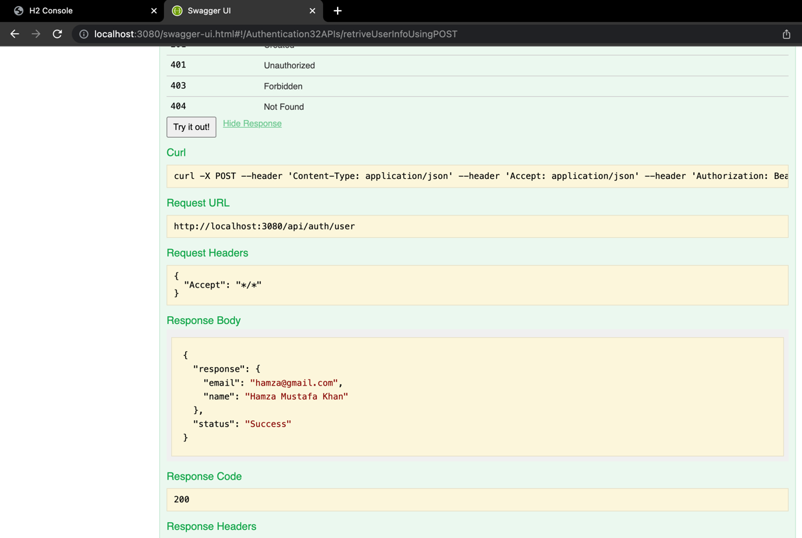

# Authentication System

This project deals with authentication and authorization of user 

- **Flow of the system**
  - Open the code on any editor (IntelliJ, VSCode, etc.)
  - For IntelliJ, run the code by clicking the play button or by going into the class `AuthenticationApiApplication.java` and 
  clicking the main to run 
  - **Note:** While opening the project in other machine and get maven plugin or sync error, just ignore it
      and run the program.
  - Upon starting the application, the database gets initialized with preloaded user with following credentials
    - Email: `hamza@gmail.com`
    - Password: `1234567`
  - Upon starting, one will be able to see database operations printed on the console of the code editor.
  - The console is accessible through the link `http://localhost:3080/h2-console`
  - **Note:** On the console if you find the JDBC URL to be other than `jdbc:h2:mem:auth`, kindly replace it with the mentioned one. 
  - The user related can be fetched using `SELECT * FROM USER` on H2 console (url mentioned above)
  

- **Project Configuration Description**
  - Runs on port `3080`. Can be configured in application.properties file.
  - **Note**: If port error occurs, you can use the command `kill -9 $(lsof -ti:3080)` for `Mac`. For `Windows`, first
    enter `netstat -ano | findstr 3080` which will return the result with PID then enter taskkill /F /PID [PID from result like 572]
  - The database is based on H2. The H2 console can be accessed by url
    `http://localhost:3080/h2-console`. Just login into the console, the credentials are already set.
  - The database has been to initialize and import data from `data.sql` on start of the application.
  - Swagger (OpenAPI) has also been configured
  - When calling a restricted API from Swagger, kindly pass the token with string `Bearer [token]`, 
  with space between the word `Bearer` and the token itself
  - A user has been included at the start of initilization of the project with credentials mentioned above
  - Token (JWT) based authentication has been implemented alongwith the feature of refreshing an expired token
  - Login, Signup & Forgot password functionality has been implemented
  - `TokenUtil.java` contains the configuration of creating the token and refreshing it
  

- **Project Working Description**
 
  - After the project starts, signin API can be called with the above credentials.
  - At every invalid credential being entered, a count is being increased in the database for the respective user. Upon
  entering the invalid credentials three times, the user becomes inactive and can only become active by resetting the
  password.
  - For resetting the password, an API will be called with the email of the user. The user will receive an request 
  approval mail with the link in it which approves the password reset request. This mail is sent from an account 
  `test.hamzamk@gmail.com` with credentials being set in `application.properties`
  - After the approval, only then the password can be reset

- **APIs Description**
    - For signing up
      - `POST /api/auth/signup`
    - For signing in
      - `POST /api/auth/signin`
    - For submitting reset password request
      - `POST /api/auth/request-reset-password`
    - For approving the submitted request
      - `GET /api/auth/approve-request-reset-password/{id}`
    - For resetting the password
      - `POST /api/auth/reset-password`
    - For getting info of a user
      - `POST /api/auth/user`

  

- **Other details**
  - Tests are implemented in `AuthenticationApiApplicationTests.java`
  - Exception handling is implemented in `ExceptionHandler`
  - Implmentation is done on the basis of single environment/profile.

- **For running via docker**
  - Dockerfile has been included in the project directory
  - Open the project directory in terminal, then run `sudo docker build -t authentication-api .` be sure to include `.` in the end
  - Then via terminal (not necessarily in the directory) run `sudo docker run -p 3080:3080 authentication-api`
  - The project starts running
  

- **Working Screenshots**

 H2-Console with initialized user

Signup API 

Signin API

Swagger with Bearer token

Swagger testing User Info API